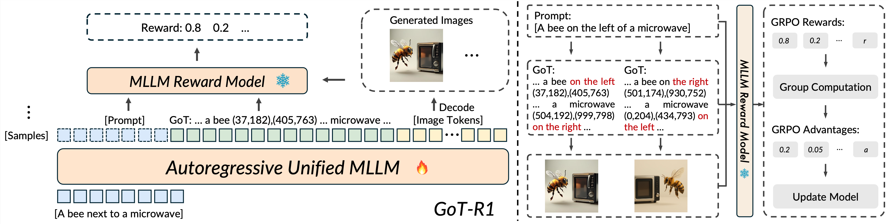

# GoT-R1: Unleashing Reasoning Capability of MLLM for Visual Generation with Reinforcement Learning
<div align="center">
<a href="[PROJECT_HOMEPAGE_LINK_PLACEHOLDER]"></a>
<a href="[ARXIV_LINK_PLACEHOLDER]"></a>

  
[Chengqi Duan](https://scholar.google.com/citations?user=r9qb4ZwAAAAJ&hl=zh-CN)<sup>1\*</sup>, [Rongyao Fang](https://scholar.google.com/citations?user=FtH3CW4AAAAJ&hl=en)<sup>2\*</sup>, [Yuqing Wang](https://scholar.google.com/citations?user=QC7nNe0AAAAJ&hl=zh-CN&oi=ao)<sup>1\*</sup>, [Kun Wang]()<sup>3</sup>, [Linjiang Huang](https://leonhlj.github.io/)<sup>4</sup>, [Xingyu Zeng]()<sup> </sup>, [Hongsheng Li](https://www.ee.cuhk.edu.hk/~hsli/)<sup>2</sup>, [Xihui Liu](https://xh-liu.github.io/)<sup>1 :envelope:</sup>

<sup>1</sup>HKU MMLab, <sup>2</sup>CUHK MMLab, <sup>3</sup>Sensetime, <sup>4</sup>Beihang University

\*Equal contribution, :envelope:Corresponding authors
</div>

<div align="center">
  
  
</div>
<hr>
<div align="center" style="line-height: 1.2;">
  <a href="[PAPER_PDF_LINK_PLACEHOLDER]" target="_blank"><b>Paper (PDF)</b></a> •
  <a href="#introduction">Introduction</a> •
  <a href="#framework-overview">Framework</a> •
  <a href="#key-features">Key Features</a> •
  <a href="#license">License</a> •
  <a href="#citation">Citation</a>
</div>

## Introduction

Visual generation models have made remarkable progress but still struggle with complex prompts that specify multiple objects with precise spatial relationships and attributes. This limitation often stems from a direct mapping from text embeddings to visual features without explicit reasoning about the compositional structure.

We present **GoT-R1**, a framework that significantly enhances semantic-spatial reasoning in visual generation by applying reinforcement learning. Building upon the Generation Chain-of-Thought (GoT) approach, GoT-R1 enables models to autonomously discover effective reasoning strategies that go beyond predefined templates. This is achieved through a carefully designed dual-stage, multi-dimensional reward framework that leverages Multimodal Large Language Models (MLLMs) to evaluate both the intermediate reasoning process and the final visual output. Our reward system assesses semantic alignment, spatial accuracy, and visual quality in a unified manner. Experimental results demonstrate significant improvements on benchmarks like T2I-CompBench, particularly in compositional tasks requiring precise spatial relationships and attribute binding. GoT-R1 advances the state-of-the-art by successfully transferring sophisticated reasoning capabilities to the visual generation domain.

GoT-R1 pioneers advancements in reasoning-driven visual generation by:
- **Enhanced Semantic-Spatial Reasoning**: Utilizes reinforcement learning to improve the model's ability to understand and plan complex scenes with accurate object attributes and spatial arrangements.
- **Autonomous Reasoning Chain Discovery**: Moves beyond fixed templates by allowing the model to autonomously explore and learn more effective reasoning chains.
- **Comprehensive MLLM-based Rewards**: Implements a novel dual-stage, multi-dimensional reward system for effective supervision across the entire generation pipeline.


## Released Model: GoT-R1

| Model         | Link                                                        |
|---------------|-------------------------------------------------------------|
| **GoT-R1-1B** | [🤗 HuggingFace](https://huggingface.co/gogoduan/GoT-R1-1B) |
| **GoT-R1-7B** | [🤗 HuggingFace](https://huggingface.co/gogoduan/GoT-R1-7B) |


## Framework Overview

GoT-R1 builds upon the Generation Chain-of-Thought (GoT) framework by introducing reinforcement learning (RL) to refine the model's semantic-spatial reasoning capabilities. The base model is a unified MLLM architecture (e.g., Janus-Pro) that autoregressively generates a textual reasoning chain followed by image tokens.

The RL process involves:
1.  Sampling multiple reasoning chains (GoT) and corresponding images for a given prompt.
2.  Evaluating these samples using our multi-dimensional MLLM-based reward model.
3.  Updating the model parameters using Group Relative Policy Optimization (GRPO) to encourage high-reward reasoning and generation strategies.

<div align="center">
  
</div>

## Key Features

### MLLM-based Dual-stage Multi-dimensional Reward

A core innovation of GoT-R1 is its comprehensive reward framework designed to address the unique challenges of applying RL to visual generation. This system evaluates both the intermediate reasoning process and the final image:

-   **Prompt-to-Reasoning Semantic Reward ($R_{sem}$)**: Assesses if the reasoning chain accurately captures all semantic elements (objects, attributes) from the prompt without contradiction. It considers completeness, faithfulness, consistency, and clarity.
-   **Prompt-to-Reasoning Spatial Reward ($R_{spa}$)**: Evaluates the correctness of planned spatial arrangements in the reasoning chain relative to the prompt. To enhance MLLM's spatial evaluation, textual coordinates are rendered as bounding boxes on a blank canvas for visual assessment.
-   **Reasoning-to-Image Reward ($R_{RI}$)**: Measures how faithfully the generated image reflects the planned reasoning, checking if objects appear at their specified locations using IoU between planned and grounded bounding boxes.
-   **Prompt-to-Image Reward ($R_{PI}$)**: Assesses the overall quality and compositional accuracy of the final generated image against the initial prompt.

The total reward $R_{total}$ is a product of these individual rewards, ensuring holistic optimization: $R_{total} = R_{PI} \cdot (R_{sem} + R_{spa}) \cdot R_{RI}$.

<div align="center">
  
</div>

## Usage

### Dependencies
- Python >= 3.8 (Recommend to use [Anaconda](https://www.anaconda.com/download/#linux))
- [PyTorch >=2.0.1](https://pytorch.org/)
- NVIDIA GPU + [CUDA](https://developer.nvidia.com/cuda-downloads)

### Installation
Clone the repo and install dependent packages.
```bash
git clone git@github.com:gogoduan/GoT-R1.git
cd GoT-R1
pip install -r requirements.txt
```
This automatically downloads **cuda-11.7** and pytorch-2.0.1. If you are using sm-90 GPUs like Nvidia H100, please download **cuda-11.8**。


### Model Weights
Expected directory structure might be:
```
GoT-R1
├── ckpts
│   ├── GoT-R1-1B 
│   ├── GoT-R1-7B 
├── ...
```

### Inference
```python
python infer.py --ckpt_path <Your GoT-R1 checkpoint path>
```

### License
This code is released under the MIT License.

### Citation
If you find this work helpful, please consider citing:
```
```

### Contact
If you have any questions, please raise an issue or contact us at (duancq24@connect.hku.hk)[duancq24@connect.hku.hk].
